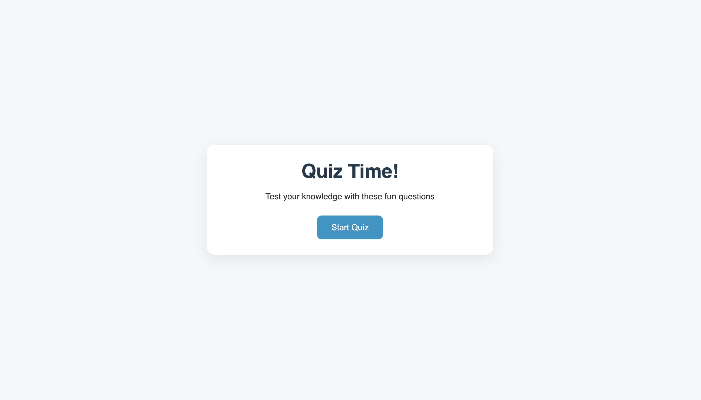
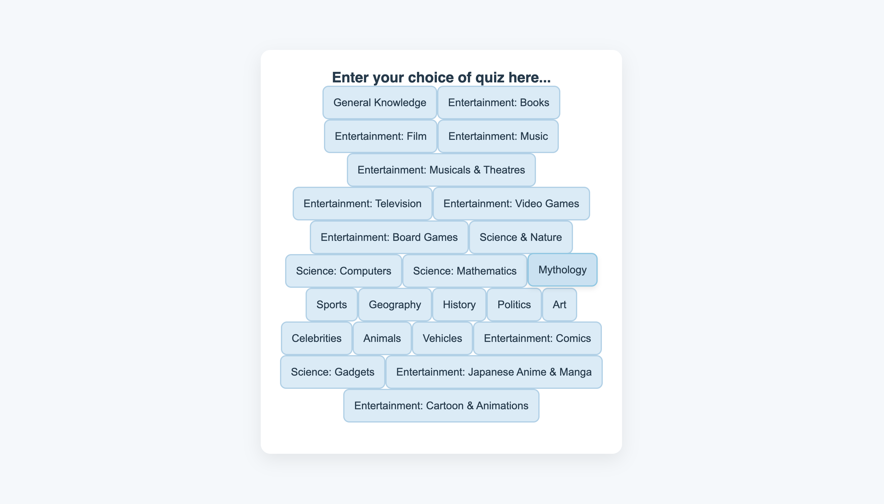
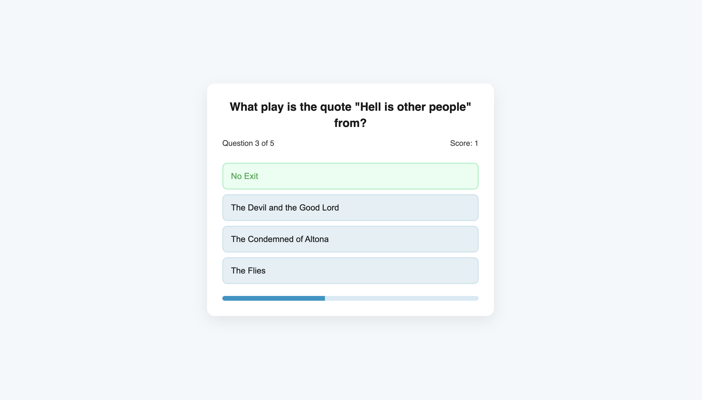
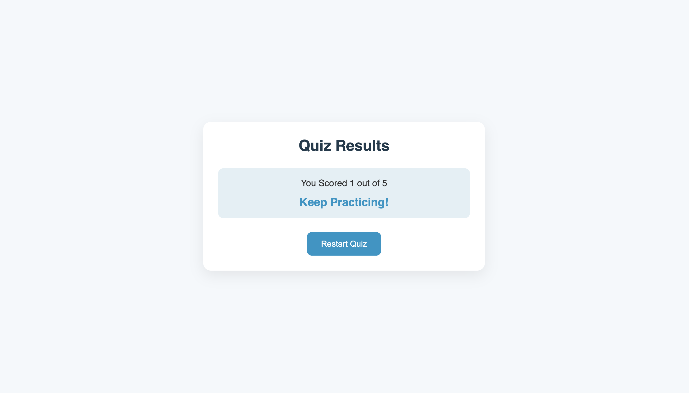

# 🧠 Responsive Quiz App with Trivia API

An elegant and fully responsive web-based quiz application built using **HTML**, **CSS**, and **Vanilla JavaScript**. This app integrates the [Open Trivia Database API](https://opentdb.com/) to fetch real-time multiple-choice questions. Users can choose a quiz category, answer 10 randomized questions, and get a final score with a motivational review.

> 🚀 [Live Demo](https://arjun-p-manoj.github.io/Quiz-app/)  
> 👨‍💻 Built by [Arjun P Manoj](https://github.com/arjunpmanoj)

---

## ✨ Features

- 🎯 **Category Selection** – Choose from multiple quiz topics.
- 📡 **Real-time Questions** – Fetched from the Open Trivia API.
- 🔀 **Dynamic Answer Shuffling** – Prevents pattern recognition.
- ✅❌ **Instant Feedback** – See if your answer is correct or not immediately.
- 📊 **Final Score with Review** – At the end of the quiz, see your performance.
- 📱 **Fully Responsive Design** – Optimized for desktop, tablet, and mobile.
- ⚡ **Lightweight** – Pure HTML, CSS & JS (no frameworks).

---

## 📸 Screenshots

### 🏠 Landing Page


### 📂 Category Selection


### ✅ Correct Answer Feedback


### ❌ Incorrect Answer Feedback


### 🧾 Final Result Screen


---

## 🛠 Tech Stack

- **HTML5** – Structure and layout
- **CSS3** – Styling and responsive design
- **JavaScript (ES6)** – Dynamic rendering and logic
- **[Open Trivia API](https://opentdb.com/)** – Question source

---

## 📦 Getting Started

To run this project locally:

```bash
# Clone the repository
git clone https://github.com/arjunpmanoj/Quiz-app.git

# Navigate into the folder
cd Quiz-app

# Open the app
Open index.html in your browser
